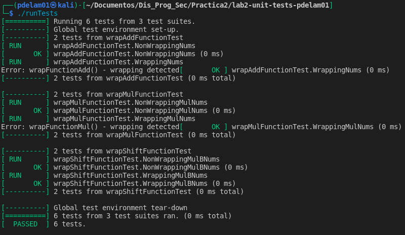

# MUIC - DPS - Laboratorio 2

Una vez configurado GTest, se ha procedido corregir las funciones en *exampleFunction.cpp*, de tal manera que no se produjese *wrapping* en estas:
- **wrapFunctionAdd()**: se ha añadido un test de precondición para asegurarnos que la suma de los operandos no ocasiona wrapping:
```
if (UINT_MAX - ui_a < ui_b) {
    /* Handle error */
}else{
    /* Perform operation */
}
```
- **wrapFunctionMul()**: de forma similarlo a lo realizado con la suma, se ha añadido un test de precondición para asegurarnos que la multiplicación no produce wrapping:
```
if (UINT_MAX / ui_a < ui_b) {
    /* Handle error */
}else{
    /* Perform operation */
}
```
- **wrapFunctionShift()**: para evitar wrapping, se ha utilizado la función *__builtin_popcount(UINT_MAX)*, que nos proporciona la precisión correcta para realizar operaciones de desplazamiento de bits. Se elimina así la posibilidad de realizar un desplazamiento mayor o igual al número de bits que existen en la parte izquierda y derecha de los operandos:
```
if (ui_b >= __builtin_popcount(UINT_MAX)) {
    /* Handle error */
} else {
    /* Perform operation */
}
```

Realizado esto, procedemos a pasar los tests. Para ello, y una vez configurado GTest, corremos los siguientes comandos:
```
$ make
$ ./runTests
```
Se han modificado dos tests; aquellos que producian warapping, adaptándolos a la salida que el código da cuando se produce:
```
TEST(wrapAddFunctionTest, WrappingNums) {
    ASSERT_EQ(-1, wrapFunctionAdd(UINT_MAX,1)); /* Previamente devolvía 0 */
}

TEST(wrapMulFunctionTest, WrappingMulNums) {
    ASSERT_EQ(-1, wrapFunctionMul(UINT_MAX, UINT_MAX)); /* Previamente devolvía 1 */
}
```
Finalmente, obtenemos los siguientes resultados:


